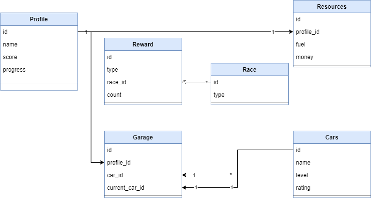
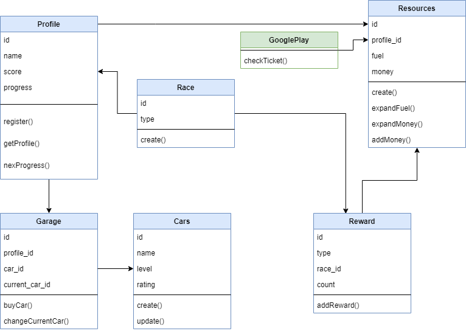

- `Пользователь` первый раз входит в игру
- Приложение отправляет на почту `письмо` с проверочным кодом
- Приложение создает `профиль` игрока
- Приложение создает `кошелек` игрока
- Приложение создает `гараж` игрока
- `Пользователь` может выбрать `авто` для `заезда`
- `Пользователь` может просмотреть` баланс денег` в `кошельке`
- `Пользователь` может просмотреть свои ` очки опыта` в `профиле`
- `Пользователь` может просмотреть остаток ` топлива`
- `Пользователь` может запустить `заезд`
- Приложение списывает `топливо`
- `Пользователь` завершает `гонку`
- Приложение начисляет `очки опыта`
- Приложение начисляет `награду`
- `Пользователь` может купить `авто` в `гараже`
- Приложение списывают `деньги` из `кошелька`
- `Пользователь` может изменить `текущий автомобиль`
- `Пользователь` может пополнить `кошелек`  
- Google play присылает `тикет` покупки
- Приложение проверяет `тикет` во внешней системе 
- Приложение зачисляет `деньги` в `кошелек` 

Верхнеуровневые сущности

- Пользователь
- Профиль
- Кошелек
- Гараж
- Авто
- Заезд
- Топливо
- Опыт
- Награда
- Деньги
- Текущий авто
- Тикет покупки
- Письмо

Внешние сервисы:
- Google play

##Сущности

##Взаимодействие сервисов

